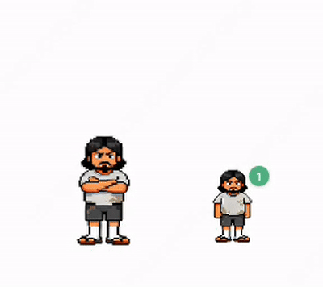

<div align="center">

# 峰哥桌面宠物

**祝大家发东南西北旋风财。**

二次元峰哥，常驻你的桌面。<br/>
像素风动画 · 经典语录 · 开机自启 · 支持自定义。


</div>

---

<div align="center">

</div>

---

## ✨ 功能

- 9 种动画状态随机轮播（站立 / 发呆 / 抱臂 / 摸胡子 / 自拍 / 投降 / 向左跑 / 向右跑 / 奔跑）
- 点击角色触发反应动画，必出语录气泡
- 空闲时随机冒语录，包含峰哥经典名言
- 拖拽移动位置，自动记忆上次位置
- 开机自启动
- 右键菜单 → **编辑语录**，保存即生效，无需重启
- 右键菜单 → **关闭宠物**

---

## 📦 安装

### 下载 Release（推荐）

前往 [Releases](../../releases) 下载对应版本的 `.zip`，解压后双击 `fengge-pet.app` 即可。

| 文件 | 适用机型 |
|---|---|
| `fengge-pet-1.1.0-arm64-mac.zip` | Apple Silicon（M1 / M2 / M3 / M4） |
| `fengge-pet-1.1.0-mac.zip` | Intel 芯片 |

> **⚠️ 首次打开提示"无法验证开发者"？**
>
> 在终端执行以下命令后即可正常打开（每台 Mac 只需执行一次）：
>
> ```bash
> xattr -cr fengge-pet.app
> ```
>

### 本地运行

```bash
git clone https://github.com/shaozhengmao/fengge-pet.git
cd fengge-pet
npm install
npm start
```

---

## 💬 自定义语录

右键点击角色 → **编辑语录**，用文本编辑器打开 `~/.fengge-quotes.txt`，每行一句，保存后立即生效，无需重启。

建议每句控制在 20 字以内，太长会撑出气泡。

默认语录：

```
祝大家长生不老，永远不死
这是个好事儿啊
大家好，我是二次元峰哥
祝大家发东南西北旋风财
上舰长，送我的写真集
祝大家开上帕拉梅拉，住上大平层
学生最烦人了
```

---

## 🖥️ 系统要求

- macOS（Apple Silicon / Intel 均支持）
- Node.js 18+（仅本地运行时需要）

---

## 📄 License

MIT
